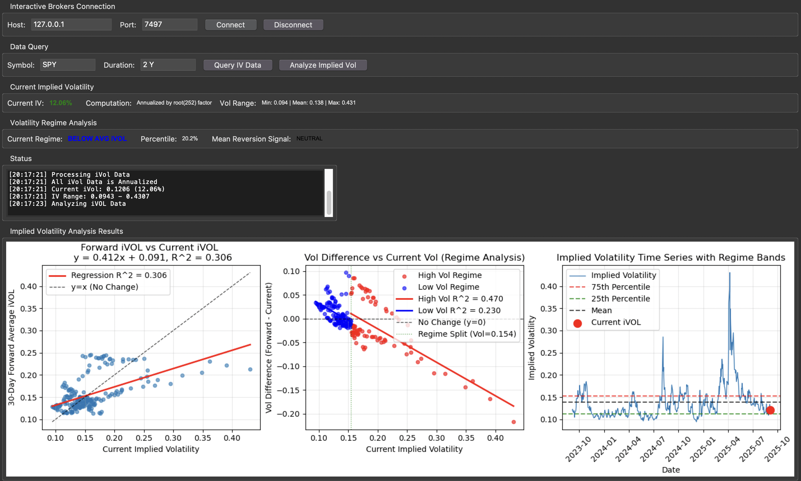

# Implied Volatility Trading Dashboard

This project is an interactive dashboard developed in Python using Tkinter and Matplotlib, designed to analyze the implied volatility of equities through data retrieved from the Interactive Brokers API. The dashboard provides a complete interface that allows the user to connect directly to TWS or IB Gateway, select a market symbol, and download historical implied volatility data, which is then processed and visualized in real time.
The application goes beyond simply displaying raw data. It includes a regime analysis that classifies current volatility into different states, from low levels to extreme conditions, and generates potential mean reversion signals. In addition to showing the latest implied volatility values and their historical range, the dashboard features time series charts, scatter plots with regression analysis, and forward-looking comparisons between current and 30-day implied volatility. These tools help users interpret the market’s position relative to its history and highlight situations that may present trading opportunities.
The interface was built to be intuitive, making advanced quantitative analysis accessible even to those unfamiliar with programming or external statistical tools. Users can manage the connection, run queries, monitor system messages, and receive analytical insights directly within the dashboard. By combining statistical calculations with graphical visualization, this project serves as both a practical tool and a learning resource for exploring implied volatility and its interpretation in financial markets.
To run the dashboard, Python 3.9 or later is required along with the dependencies listed in `requirements.txt`. After starting TWS or IB Gateway with the API enabled, the program can be launched from the terminal using `python dashboard.py`. Once the interface is open, users can set their parameters and initiate analysis with just a few clicks. A preview image of the interface is included in the `assets/` folder to provide a visual reference of the dashboard in action.

